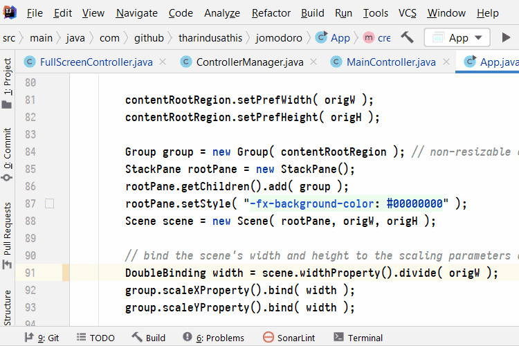
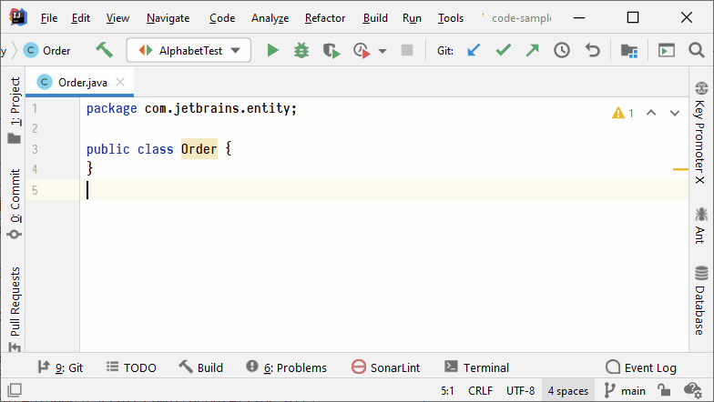
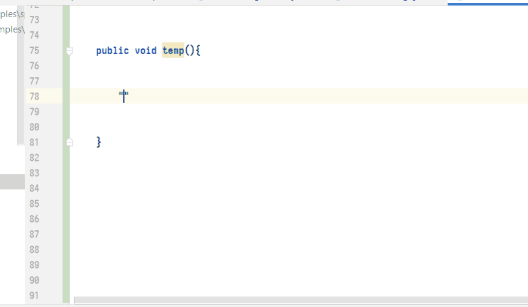
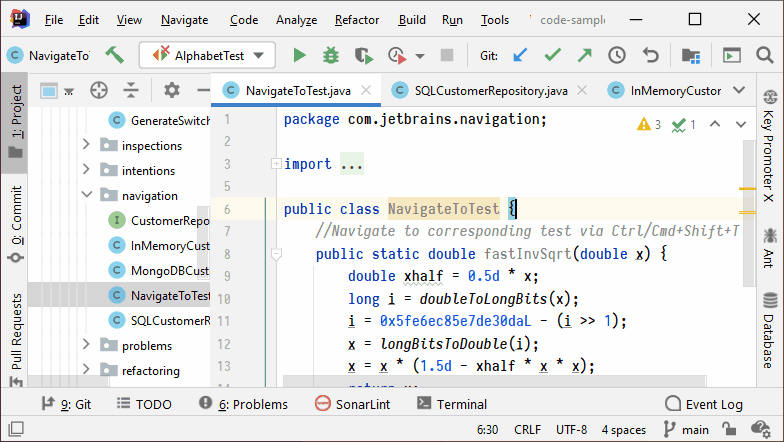
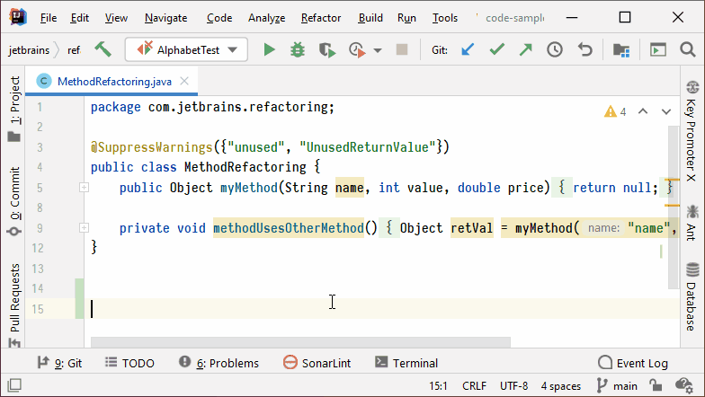

IntelliJ Keyboard Shortcuts
---

A curated list of favorite keyboard shortcuts of IntelliJ-based IDEs. 

___

| Key-binding                   | Action                     | Preview                                                      |
| ----------------------------- | -------------------------- | ------------------------------------------------------------ |
| `Alt + Enter`                 | Show Intention Actions     |
| `F2`                          | Next Highlighted Error     |
| `Alt + 1` `⌘ 1`            | Project Tool Window        |  |
| `Esc`                         | Focus on the Editor        |
| `Ctrl + E` `⌘ E`           | View Recent Files          |          |
| `Ctrl + B` `⌘ B`           | Go to Declaration          |
| `Alt + F7`                    | Find Usages                |
| `Ctrl Ctrl`                   | Run Anything               |
| `Ctrl + W`    `⌥↑`         | Extend Selection           |
| `Shift + Ctrl + W`   `⌥↓`  | Shrink Selection           |
| `Ctrl + /` `⌘ /`           | Add/Remove Line Comment    |
| `Shift + Ctrl + /` `⌥⌘/`   | Add/Remove Block Comment   |
| `Shift+Ctrl+Enter`   `⇧⌘⏎` | Complete Current Statement |
| `Ctrl+Alt+L`   `⌥⌘L`       | Reformat Code              |
| `Shift+Ctrl+Alt+T`   `⌃T`  | Refactor This              |
| `Shift+Ctrl+A`   `⇧⌘A`     | Find Action                |
| `Shift Shift`                 | Search Everywhere          |

---
## Tool Windows 

| Key-binding        | Action               | Preview                                                      |
| ------------------ | -------------------- | ------------------------------------------------------------ |
| `Alt + 1` `⌘ 1` | Project Tool Window  |  |
| `Alt + 6` `⌘ 6` | Problems Tool Window |                                                              |
| `Alt + 7`       | File Structurre      |                                                              |

---
## Refactoring

| Key-binding          | Action             | Preview                                                  |
| -------------------- | ------------------ | -------------------------------------------------------- |
| `Ctrl + Alt + V`  | Introduce Variable |  |

---
## Quick Navigation

| Key-binding                         | Action                                         | Preview                                                |
| ----------------------------------- | ---------------------------------------------- | ------------------------------------------------------ |
| `Ctrl + N`                       | Navigate to a class                            |  |
| `Shift + Ctrl + N`               | Navigate to a file                             |    |
| `Shift + Ctrl + Alt + N` `⌥ ⌘ O` | Navigate to a symbol                           |                                                        |
| `Shift Shift`                       | Search Everywhere                              |
| `Shift +Ctrl + T`                | Navigate between Test file & Test subject file |                                                        |
| `Shift + Ctrl + E`               | Recent Locations                               |    |
| `Alt + Home`                     | Jump to Navigation Bar                         |                                                        |
| `Ctrl + Alt + Left/Right`        | Navigate Back/Forwad                           |                                                        |

___

### Resources

* IntelliJ IDEA Samples for Tips and Tricks, Features, etc.: <https://github.com/JetBrains/intellij-samples>
* Top 15 IntelliJ IDEA shortcuts (2020): <https://www.youtube.com/watch?v=QYO5_riePOQ&t>
* More IntelliJ IDEA Tips and Tricks by Trisha Gee: <https://www.youtube.com/watch?v=9AMcN-wkspU>