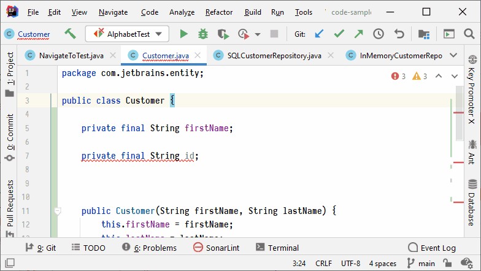
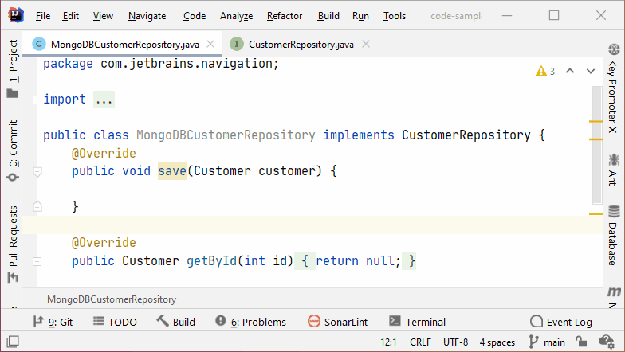
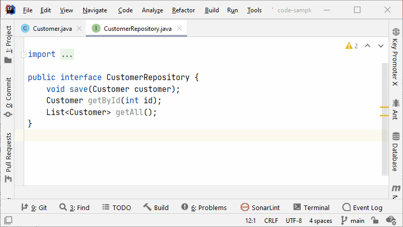
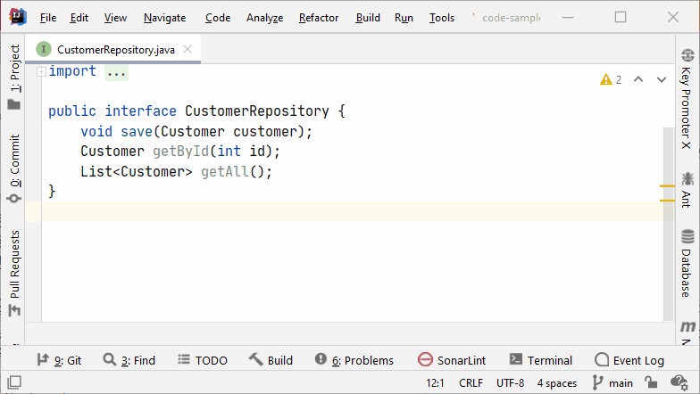
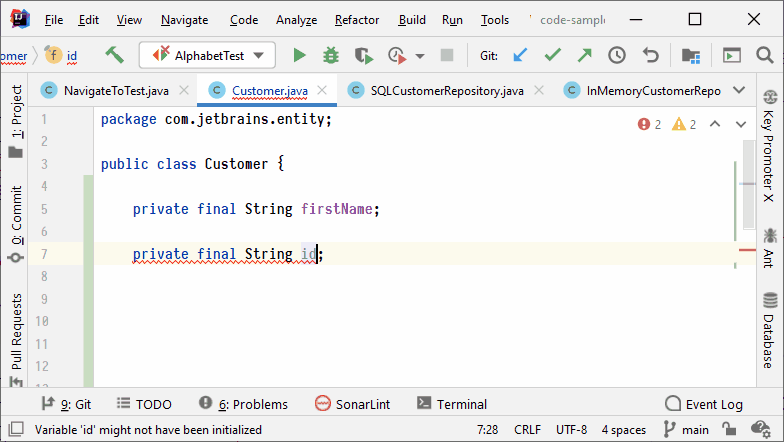
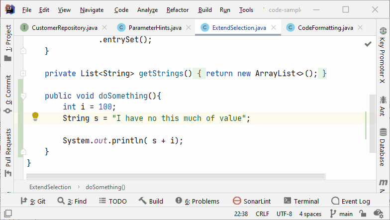
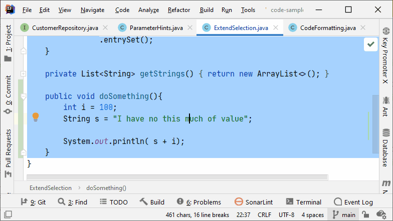
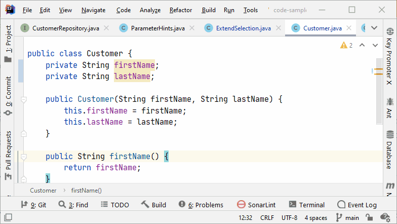
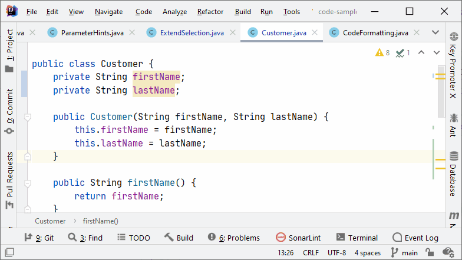
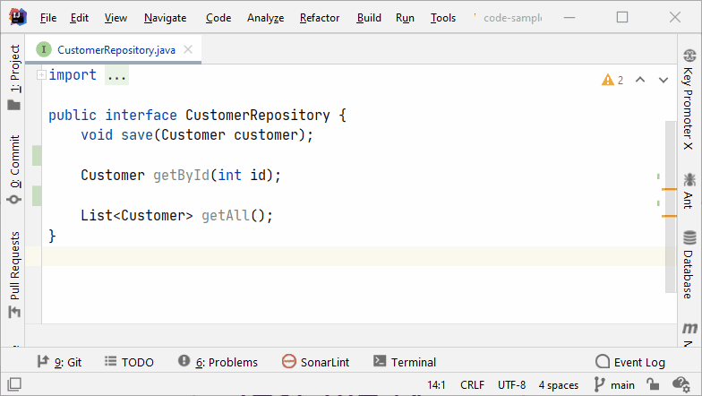

IntelliJ Keyboard Shortcuts
---

A curated list of favorite keyboard shortcuts of IntelliJ-based IDEs. 

- [Quick Navigation](#quick-navigation)
- [Editor](#editor)
- [Refactoring](#refactoring)
- [Tool Windows](#tool-windows)
- [All](#all)
- [Resources](#resources)

---

## Quick Navigation

| Key-binding                 | Action                                         | Preview                                                          |
| --------------------------- | ---------------------------------------------- | ---------------------------------------------------------------- |
| `Ctrl+E` `⌘E`            | Recent Files                                   |                  |
| `Shift+Ctrl+E`           | Recent Locations                               |              |
| `Ctrl+N`                 | Navigate to a class                            |            |
| `Shift+Ctrl+N`           | Navigate to a file                             |              |
| `Shift+Ctrl+Alt+N` `⌥⌘O` | Navigate to a symbol                           |                                                                  |
| `Shift Shift`               | Search Everywhere                              |
| `Shift+Ctrl+T`           | Navigate between Test file & Test subject file |                                                                  |
| `Alt+Home`               | Jump to Navigation Bar                         |                                                                  |
| `Ctrl+Alt+Left/Right`    | Navigate Back/Forwad                           |                                                                  |
| `F2`                        | Next Highlighted Error                         |  |
| `Ctrl+B` `⌘B`            | Go to Declaration                              |             |
| `Alt+F7`                    | Find Usages                                    |                          |
| `Ctrl+Alt+F7`               | Show Usages                                    |                          |

___
## Editor 

| Key-binding                   | Action                     | Preview                                                          |
| ----------------------------- | -------------------------- | ---------------------------------------------------------------- |
| `Alt+Enter`                   | Show Intention Actions     |      |
| `F2`                          | Next Highlighted Error     |  |
| `Ctrl+W`    `⌥↑`           | Extend Selection           |              |
| `Shift+Ctrl+W`   `⌥↓`      | Shrink Selection           |              |
| `Ctrl+/` `⌘/`              | Add/Remove Line Comment    |                      |
| `Shift+Ctrl+/` `⌥⌘/`       | Add/Remove Block Comment   |                    |
| `Shift+Ctrl+Enter`   `⇧⌘⏎` | Complete Current Statement |          |
| `Ctrl+Alt+L`   `⌥⌘L`       | Reformat Code              |                              |
| `Shift+Ctrl+Alt+T`   `⌃T`  | Refactor This              |                    |
---
## Refactoring

| Key-binding      | Action             | Preview                                                  |
| ---------------- | ------------------ | -------------------------------------------------------- |
| `Ctrl+Alt+V`  | Introduce Variable |  |

---
## Tool Windows 

| Key-binding     | Action               | Preview                                                      |
| --------------- | -------------------- | ------------------------------------------------------------ |
| `Alt+1` `⌘1` | Project Tool Window  |  |
| `Alt+6` `⌘6` | Problems Tool Window |                                                              |
| `Alt+7`      | File Structurre      |                                                              |

---
## All

| Key-binding                   | Action                     | Preview                                                          |
| ----------------------------- | -------------------------- | ---------------------------------------------------------------- |
| `Alt+Enter`                   | Show Intention Actions     |      |
| `F2`                          | Next Highlighted Error     |  |
| `Alt+1` `⌘1`               | Project Tool Window        |      |
| `Ctrl+E` `⌘E`              | View Recent Files          |              |
| `Ctrl+B` `⌘B`              | Go to Declaration          |             |
| `Alt+F7`                      | Find Usages                |                          |
| `Ctrl+Alt+F7`                 | Show Usages                |                          |
| `Ctrl Ctrl`                   | Run Anything               |                      |
| `Ctrl+W`    `⌥↑`           | Extend Selection           |              |
| `Shift+Ctrl+W`   `⌥↓`      | Shrink Selection           |              |
| `Ctrl+/` `⌘/`              | Add/Remove Line Comment    |                      |
| `Shift+Ctrl+/` `⌥⌘/`       | Add/Remove Block Comment   |                    |
| `Shift+Ctrl+Enter`   `⇧⌘⏎` | Complete Current Statement |          |
| `Ctrl+Alt+L`   `⌥⌘L`       | Reformat Code              |                              |
| `Shift+Ctrl+Alt+T`   `⌃T`  | Refactor This              |                    |
| `Shift+Ctrl+A`   `⇧⌘A`     | Find Action                |                        |
| `Shift Shift`                 | Search Everywhere          |            |
---

### Resources

* IntelliJ IDEA Samples for Tips and Tricks, Features, etc.: <https://github.com/JetBrains/intellij-samples>
* Top 15 IntelliJ IDEA shortcuts (2020): <https://www.youtube.com/watch?v=QYO5_riePOQ&t>
* More IntelliJ IDEA Tips and Tricks by Trisha Gee: <https://www.youtube.com/watch?v=9AMcN-wkspU>